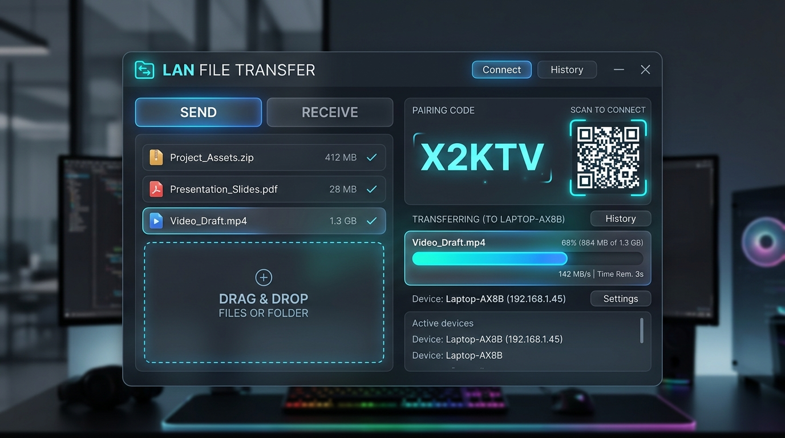
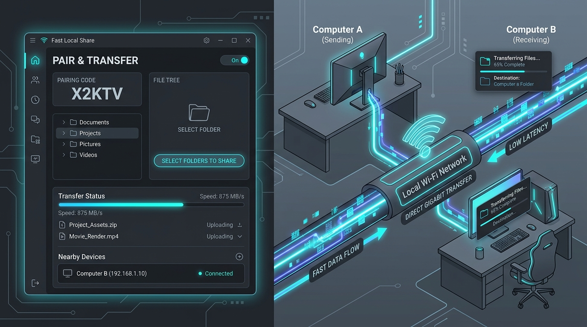

# 局域網檔案快傳 (LAN File Transfer) ⚡

> **極速、隱私、零雲端中轉的局域網跨裝置檔案傳輸工具**  
> *Effortless, high-speed, zero-cloud peer-to-peer LAN file sharing application for Windows Desktop & Local Devices.*



---

## 🌟 核心特色 (Key Features)

- 🚀 **極速局域網直連 (Zero-Cloud P2P)**: 檔案完全在本地 Wi-Fi / 局域網內直連傳輸，不經過任何外部雲端伺服器，隱私安全無虞且速度達局域網硬體極限（千兆 / 2.5G / Wi-Fi 6）。
- 🔑 **5 位快速配對碼 (5-Character Pairing Code)**: 傳送端一鍵啟動分享，即時生成簡潔、無混淆字元的 5 位字母數字配對碼（例如 `X2KTV`）及動態 QR Code。
- 📡 **UDP 自動廣播與發現 (LAN Auto-Discovery)**: 接收端打開程式即可自動搜尋並列出區域網路中所有正在傳送的電腦，點擊「接收」一鍵秒連。
- 📁 **自訂儲存資料夾 (Custom Destination Folder)**: 接收檔案前會彈出原生資料夾選擇器，讓您自由決定儲存路徑，傳輸完成後可直接在檔案總管中開啟。
- 💾 **零記憶體占用串流傳輸 (Zero-RAM Resilient Streaming)**: 基於 Node.js 檔案流 (`fs.createWriteStream`) 與反壓機制，傳輸 10GB+ 4K 影片或大型壓縮檔皆穩定不崩潰，完美解決瀏覽器下載大小限制與快取錯誤。
- 📦 **單檔免安裝版 (.exe)**: 提供單一綠色執行檔，直接傳給家人或朋友電腦即可雙擊秒開，無需安裝 Node.js 或任何環境。

---

## 🔄 傳輸架構與流程 (Architecture & Flow)



```text
┌────────────────────────────────────────────────────────┐
│               傳送端 SENDER (Desktop .exe)              │
│                                                        │
│  1. 拖曳/選擇任意大小檔案或資料夾                          │
│  2. 點擊「開始傳送」                                    │
│  3. 自動生成 5 位配對碼 (如 X2KTV) 與 UDP 局域網廣播信標    │
│  4. 提供高吞吐量 Node.js HTTP/WS 流式串流服務           │
└───────────────────────────┬────────────────────────────┘
                            │ LAN TCP Stream & UDP Beacon
                            ▼
┌────────────────────────────────────────────────────────┐
│               接收端 RECEIVER (Desktop .exe)            │
│                                                        │
│  1. 切換至「接收檔案」分頁                              │
│  2. 點擊自動發現的傳送端卡片，或直接輸入 5 位配對碼        │
│  3. 彈出資料夾選擇視窗指定儲存位置                      │
│  4. 高速直寫硬碟，即時顯示 MB/s 速度與剩餘時間預估        │
└────────────────────────────────────────────────────────┘
```

---

## 💻 快速開始 (Quick Start)

### 1. 取得執行檔 (Pre-built Executable)
您可以在 [`release/`](release/) 目錄下找到已打包的 Windows 程式：
- **免安裝版**: `LAN File Transfer 1.0.0.exe`（直接雙擊執行）
- **安裝版**: `LAN File Transfer Setup 1.0.0.exe`

### 2. 開發與原始碼編譯 (Build from Source)

**前置需求**:
- Node.js (v18+)
- npm 或 yarn

```bash
# 1. 複製專案庫
git clone https://github.com/your-username/lan-file-sharing.git
cd lan-file-sharing

# 2. 安裝相依套件
npm install

# 3. 啟動桌面應用程式 (開發模式)
npm start

# 4. 執行完整自動化測試
npm test

# 5. 打包為 Windows .exe 執行檔
npm run dist
```

打包完成後，獨立的 `.exe` 檔案將自動生成於 `release/` 資料夾中。

---

## 🛠️ 技術棧 (Tech Stack)

- **桌面框架**: Electron 44, TypeScript
- **前端介面**: React 19, Vite, Tailwind CSS 4, Lucide Icons
- **傳輸核心**: Node.js HTTP Streaming, WebSocket (`ws`), UDP Multicast/Broadcast (`dgram`)
- **打包工具**: electron-builder, NSIS
- **單元測試**: Vitest (24/24 passed)

---

## 📄 開源授權 (License)

本專案採用 [MIT License](LICENSE) 授權。
